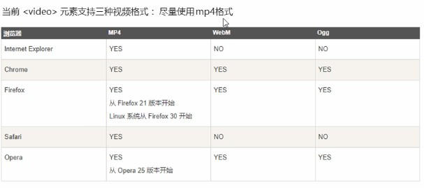

# HTML部分 #
----------------------------
html是一种标记语言,超文本标记语言

html只搭建网页框架，没有美化的外观

CSS用于美化外观

VScode按装插件

	open in borwser		可以在VScode中右键打开网页
	live Server			//可以在VScode中右键打开网页，并实时更新
	

# 申请免费服务器 #

	free.3v.do

步骤：

第一次注册需要FTP管理，记住主机名，用户名，密码，域名

上传的首页文件必须叫 index.html

# 查阅文档 #
W3C

	www.w3cschool.com

MDN
	
	MDN ：http://developer.mozilla.org/zh-CN/

菜鸟教程
	
	https://www.runoob.com/js/js-tutorial.html

# html文件名 #

	.html
	.htm
# 格式说明 #

	<!DOCTYPE html>  开头声明为 HTML5 文档

# html标签 #

VScode创建标签
	
	在VScode中创建html文件,输入!,选第一个,自动创建html标签

双标签

	
	开始标签  结束标签
单标签(数量少)

	 

标签放在<>中

标签与标签的关系

	包含
	<head>
		<title></title>
	</head>
	
	并列
	<head></head>
	<body></body>
## 路径知识 ##

相对路径，相对于当前目录的路径
	
	/	下一级目录
	../	上一级目录

## 基本结构标签 ##

	<!DOCTYPE html>		//（必写）开头声明为 HTML5 文档，第一行，文档版本声明标签
	<html lang="en">	//（必写）html标签,最大标签	
		<head>			//头部标签
			<meta charset="UTF-8">		//（必写）
			<meta name="viewport" content="width=device-width, initial-scale=1.0">
			<meta http-equiv="X-UA-Compatible" content="ie=edge">
			<title>Document</title>
		</head>	
		<body>			//主体标签,内容
			
		</body>
	</html>

### 1.html标签 ###

	<html lang="en">
		....
	</html>
	
	lang显示语言，告诉浏览器该页面的语言
		lang='en'		英语
		lang='zh-CN'	中文
		lang='fr'		法文

### 2.head标签 ###

	<meta charset="UTF-8">	//（必写）字符集存储方式，防止出现乱码

### 3.标题标签(双标签) ###

	<h1>一级标签</h1>
	...
	<h6>六级标签</h6>
	
	标题独占一行，从1到6依次变小
### 4.段落换行标签 ###

html文本中无法用回车格式分段，必须用段落标签，文本打多少个空格，网页都只显示一个

	段落标签
	
这是一段

	
	换行标签(单标签)
	 

段与段之间行间距大，换行标签行间距不变

### 5.文本格式化标签 ###

	加粗
	<b></b> 或 <strong></strong>
	
	斜体
	<i></i>	或 <em></em>
	
	删除线
	<s></s>	或 <del></del>
	
	下划线
	<u></u>	或 <ins></ins>

### 6.装内容标签 ###

	
和标签，无语义，就是个盒子，用来装内容
	
	

		//独占一行，大盒子
		//一行可以显示多个，小盒子
### 7.图像标签(单表签) ###

		
	
	src	图片路径，必写，也可复制网络中的图片地址
	alt 	替换文本，图片无法显示时显示文字
	title	提示文本，鼠标放在图像上显示的文字
	width	设置图片宽度，单位像素	 数值需要加引号
	height	设置图片高度，单位像素	 数值需要加引号
	border	设置图片边框粗细，单位像素 数值需要加引号，黑色边框
	
	width和height，只写一个时，会等比例缩放，不会失真
	
	
### 8.超链接标签 ###

	<a>中可以放元素
	
	<a href = "跳转的地址" target = "目标窗口的弹出方式">链接显示形式(文本或图像)</a>
	
	target	
	参数:	_self	在当前页面打开
			_blank	在新的标签中打开

链接分类
	
	1.外部链接
		<a href = "https://www.bilibili.com/" target = "_blank">哔哩哔哩</a>
	
	2.内部链接
		<a href = "内部html文本路径" target = "_blank">你好</a>
	
	3.空链接
		<a href = "#" target = "_blank">空</a>
	
	4.下载链接
		地址链接时文件.exe或者zip等压缩包形式
		<a href = "本地压缩包路径" target = "_blank">下载链接</a>
	
	5.锚点链接
		链接本文本中的内容
		(1)设置标签id
			<h1 id = "man">任务简介</h1>
		(2)文本中href值添加未要跳转的标签id
			<a href = "#man" >任务简介</a>

### 9.注释标签 ###

	快捷键	ctrl +	/
	<!--我叫Nyang-->

### 10.特殊字符 ###

	空格		&nbsp;
	<		&lt
	>       &gt
	&		&amp
	$		&yen
	©	版权	&copy
	®	注册	&reg
	℃		&deg
	*		&times
	/		&divide
	²		&sup2
	³		&sup3
	±		&plusmn

### 11.表格标签 ###

语法结构

	<table>
		<thead>
			<tr>
				<td>单元格文字</td>
				.....	
				<td>单元格文字</td>
			</tr>
		</thead>
		<tbody>
			<tr>
				<td>单元格文字</td>
				.....	
				<td>单元格文字</td>
			</tr>
		</tbody>
	</table>

    <table></table>	表格标签
	<tr></tr>		行标签，代表表格中的一行
	<td></td>		行中的单元格标签
	<thead></thead>	表头标签
	<tbody></tbody>	表主体标签

表格属性

	格式
	<table align="center" border ="1" cellpadding = "0" cellspacing = "0" width = "200">
		...
	</table>
	
	属性
	align			表格在网页中位置	值（left，center，right）
	border			表格是否有边框	值（1有，""无）
	cellpadding		单元格与内容间距
	cellspacing		单元格与单元格间距
	width			表格的宽度	
	hight			表格的高度

合并单元格
	
	跨行合并(上下合并)	上面作为目标单元格
		rowspan = "合并单元格的个数"
	
	跨列合并(左右合并)	左边作为目标单元格
		colspan = "合并单元格的个数"
	
	<td colspan = "2" ></td>	//合并左右两个
	<td rowspan = "2" ></td>	//合并上下两个

### 12.列表标签 ###

作用：布局，整齐，整洁，有序

语法结构

	<ul></ul>中只能放<li></li>标签
	<li></li>中可以放其他标签
	
	无序列表	
	<ul>
		<li>列表项1</li>
		<li>列表项2</li>
		<li>列表项3</li>
		......
	</ul>
	
	有序列表
	<ol>
		<li>列表项1</li>
		<li>列表项2</li>
		<li>列表项3</li>
		......
	</ol>

	去掉默认小点属性：在CSS中
		list-style：none；

### 13.自定义列表 ###

	<dl></dl>只能放<dt>和<dd>标签
	
	语法结构：
	<dl>
		<dt>名词1</dt>
	
		<dd>名词1解释1</dd>
		<dd>名词1解释2</dd>
		......
	</dl>

### 14.表单标签 ###

作用：收集用户信息

表单组成：表单域，表单控件，提示信息

语法结构

表单域

	<form action = "url地址"	method = "提交方式" name = "表单域名称">
		<label for = "name">用户名：</label><input type = "text" id = "name" value = "请输入用户名" maxiength = "5" />	 
		密码：<input type = "password" />	 
		性别：男<input type = "radio" name = "sex" />女<input type = "radio" name = "sex" checked = "checked" />	 
		爱好：吃饭<input type = "checkbox" name = "love" />睡觉<input type = "checkbox" name = "love"/>打豆豆<input type = "checkbox" name = "love" />	 
		用户留言：
		<textarea rows = "每行字符数" cols = "显示多少行">默认显示文字</textarea>
		籍贯：
		<select>
			<option selected = "selected" >宁夏</option>
			<option>北京</option>
			<option>上海</option>
		</select>
	
	</form>	
	
	属性：
	action	接收表单数据的服务器程序url地址
	method	设置表单的提交方式	值：get/post
	name	表单名称，区分一个页面的多个表单

#### 表单控件 ####

输入控件：

	<input type = "属性" name = "控件名" value = "控件默认显示的值" maxiength = "输入的最大字段长度" checked = "checked"/>
	
	type属性值：
		text		文本
		password	密码
		radio		单选按钮，name相同才行			//男<input type = "radio" />跟在值后面	
		checkbox	多选框
		submit		提交按钮，点击后数据提交到服务器
		reset		重置按钮，还原表单初始值
		file		上传文件按钮
		button		点击按钮
		image		图像形式的提交按钮
		hidden		定义需要隐藏的输入字段
html5新增表单type类型：
	

	
点击提交按钮后会验证表单内容是否正确

html5新增表单属性：

	
	required = "required"		不能为空必填项
	placeholder = "placeholder"	框内默认有内容

	name		控件名,后台人员使用
	value		控件默认显示的值,后台人员使用
	checked		只用单选或多选按钮中使用，默认被选中的按钮控件中加入
	id			标识，搭配<label>标签使用

绑定标签：绑定输入控件与文字 与id相同

	<label for = "name">用户名：</label><input type = "text" id = "name" />

下拉标签

	语法结构
		籍贯：
		<select name = "area">
			<option selected = "selected" >宁夏</option>
			<option>北京</option>
			<option>上海</option>
		</select>
	
	属性
	selected	默认选中状态

文本域标签
	
	用户留言：
	<textarea rows = "每行字符数" cols = "显示多少行">默认显示文字</textarea>
### 点击按钮 ###

按钮标签
	
	<button>按钮</button>

	</script>
	 <button id="btn" onclick="threeFn()">点我</button>

	 

	<input type="button" value="事件绑定" v-on:click = "dolt">	//单击事件
		<input type="button" value="事件绑定" v-on:monseenter = "dolt">	
		<input type="button" value="事件绑定" v-on:dblclick = "dolt">	//双击事件
		<input type="button" value="事件绑定" @dblclick = "dolt">		//简写双击事件

--------------------------------------
# CSS 部分#
---------------------------------------
## CSS介绍 ##

网页的美容师，标记语言，设置html文本内容，图片外形等

结构组成：选择器（选择需要美化的目标），样式（设置需要美化的属性）
	<head>
		
	</head>

	例：p {color:red; font-size:12px}	//
标签显示的内容成红色，字体为12号

## 选择器 ##

作用：选择标签

分类：
	
	基础选择器：单个选择器组成，标签、类、id、通配符选择器
	复合选择器：后代选择器，子选择器，并集选择器，伪类选择器

### 基础选择器 ###

选择器属性：

	width：100px		//宽100像素
	height：100px	//高100像素
	color：	red		//颜色红色
	background-color：red	//背景颜色红色
	font-size: 12px		//字体大小，12号

#### 标签选择器 ####

标签名作为选择器，选择所有的一类标签，不能差异化设置

	语法结构：
	
	
	例：
	

#### 类选择器 ####

单独选择一个或几个标签，实现标签的差异化设置

	语法结构：
	//类名自己定义，随意起，不能用标签名起类名
	
	
	

	//标签中调用类选择器
	
	例：
	
	
	
红色

#### 多类名-类选择器 ####

一个标签选择多个类名，类名与类名之间用空格隔开

	语法结构：
	//类名自己定义，随意起，不能用标签名起类名
	
	
	

	//标签中调用类选择器
	
	例：
	
	
	
红色,20号字体

#### id选择器-只能调用一次 ####

CSS中id以"#"定义，html标签用id调用

**只能调用一次**

	语法结构：
	
	
	

	//标签中调用类选择器
	
	例：
	
	
	
红色,20号字体

#### 通配符选择器 ####

选区页面中所有的标签元素都更改了属性

	语法结构：
	

### 复合选择器 ###

#### 后代选择器 ####
只更改某个标签下的某个标签的样式
		
	父元素 子元素 孙元素 {属性：值}
	
	例子：	
	ol li p {color : "red";}		//只改变ol中的li标签
	.red li p {color : "red";}
	
	<ol>			
		<li>
			

		<li>
	<ol>
	<ul class = "red">
		<li>
		<li>
	<ul>

#### 子选择器 ####

只能选儿子元素

	父元素>子元素 {属性：值}

#### 并集选择器 ####

同时将多个标签改属性，并集选择器和后代选择器子选择器可以混和使用

	元素1，元素2 {属性：值}
	
	div,p {color : "red";}
	div,p,.red li {color : "red";}		//并集选择器和后代选择器子选择器可以混和使用

#### 伪类选择器 ####

鼠标放置式变化样式

1.链接伪类选择器
	
	按顺序书写
	a:link 		//选择所有未被访问的链接
	a:visited 	//选择所有已被访问的链接
	a:hover		//选择鼠标指针位于其上的链接
	a:active	//选择鼠标按下未弹起的链接
	
	例子：
	<head>
		
	</head>
	
	<body>
		<a href="https:www.hao123.com">132链接</a>
	</body>

2.:focus伪类选择器
	
	鼠标点击的元素发生样式变化,主要针对input元素
	
	input:focus{
		background-color:pink;
		color:red;
	}
	<body>
		<input type = "text" name = "shangchuan" value = "0"/>
	</body>

## CSS字体属性 ##

设置字体的大小，粗细，样式

	font-family: '微软雅黑',Times;		//字体样式，可以写多个，先执行第一个，若浏览器没有安装该字体，则往后执行
	font-size: 10px;	//字体大小
	font-weight：normal;		//字体粗细，bold粗/bolder特粗/lighter细或数字不加px，100~900，400正常，700加粗
	font-style：italic；		//斜体

字体复合属性设置

	不能更换位置
	font：（font-style） （font-weight） font-size/（line-height） font-family
	//size，family必须写
	
	例：
	

单行文字垂直居中

	让文字行高等于盒子高度
	a {
		height:40px;
		line-height:40px;
	}

## CSS文本属性 ##
定义文本外观，如：文本对齐，装饰文本，文本缩进，行间距等

	文本颜色：
		color：red；			//green，blue，pink...
		color：#ff0000		//十六进制改变
		color：rgb(255,0,0);	//RGB改变颜色
	文本对齐：
		text-align：center；	//left，right，center
	下划线：
		text-decoration:underline;	//下划线
	删除线：
		text-decoration:line-through;	//删除线
	上划线：
		text-decoration:overline;	//上划线
	没有线：可取消链接的下划线
		text-decoration:none;		//没有线
	
	文本缩进：第一行缩进
		text-indent：10px；		//缩进10个像素
		text-indent：2em；		//em是一个字的大小单位
	行间距：
		line-height：26px；		//行间距，上间距+下间距+字高

## CSS引入方式 ##

1.行内式:直接在元素标签内部写，适合简单样式
	
	

2.内部式:也称嵌入式引用，在html内部书写
	
	<head>
		
	</head>
3.外部式：适用与样式特别多的代码
	
	引入步骤：
	1.新键CSS文件，后缀名为.css
	2.直接在css文件中写css样式，不需要

2.内边距padding，会撑大盒子

	padding-left:;			左内边距	，值px
	padding-tight:;			右内边距
	padding-top:;			上内边距
	padding-bottom:;		下内边距
	
	复合写法：
		padding：5px；		上下左右5px
		padding：5px 50px;	上下5px，左右10px
		padding：5px 50px 500px;	上5，左右50，下500
		padding：5px 50px 500px 600px; 上5右50下500左600
	
	解决会撑大盒子
		父与子标签分开设置
3.外边距margin
	
	margin-left:;		左外边距
	margin-tight:       右外边距
	margin-top:;        上外边距
	margin-bottom:;     下外边距

	值：数字px，auto自动
	
	margin：负值；解决盒子边框重合太粗的问题

	复合写法与内边距类似

盒子自动水平居中：
		
	条件：	1.盒子必须设置宽度width
			2.盒子左右外边距都设置为auto

	例：
		div {
			width：100px；
			margin：0 auto；		上下0px，左右自动
		}

外边距合并：
	
	两个盒子外边自动合并，取最大外边距
嵌套盒子的外边距塌陷问题：
	
	父元素与子元素都有上边距，则取最大的
	
	解决方法：
		1.为父元素定义上边框
			border
		2.为父元素定义上内边距
		
		3.为父元素添加overflow:hidden
清除元素内外边距：
	
	清除所有标签的默认内外边距
	* {
		padding：0；
		margin：0；
	}
#### 圆角边框 ####
	
	border-radius:;		值px，圆角半径，或百分比

	border-top-left-radius:;只设置左上角圆角
	
	复合写法与边距相似

	做圆形盒子：border-radius值设置为正方形边框的一半长度

#### 盒子阴影 ####

	box-shadow:h-shadow v-shadow blur spread color inset
	
	h-shadow	必写，水平位置，px
	v-shadow 	必写，垂直位置，px
	blur 		可选，模糊距离，影子虚实，px
	spread 		可选，阴影尺寸
	color 		可选，阴影颜色，一般用rgba（0,0,0,0.3）；
	inset		可选，写入成为内阴影

	box-shadow:10px 10px 10px -4px rgba（0,0,0,0.3）；

### 文字阴影 ###

	text-shadow:h-shadow v-shadow blur color

	h-shadow	必写，水平位置，px
	v-shadow 	必写，垂直位置，px
	blur 		可选，模糊距离，影子
	color 		可选，阴影颜色，一般

## CSS浮动 ##

标准流：标签按默认方式排列

浮动：改变标签默认的排列方式

浮动可以让标准流的文字和内容环绕着浮动的盒子，而不会压住标准流的内容

语法结构
		
	选择器 {float：属性值；}

	属性值：
		none		元素不浮动
		left		元素左浮动
		right		元素右浮动

浮动特性
	
	1.浮动元素会脱离标准流
		浮动的盒子不在保留原先的位置，原来的位置会被其他元素占有
	2.浮动元素会一行显示并且元素的顶部对齐
		
	3.浮动元素具有行内快元素特性

	4.一般不给父盒子定义高度，让子盒子撑开高度

清除浮动
	
	清除浮动元素造成的影响,闭合浮动，子盒子只在父盒子中浮动
	
	选择器 {clear：属性值；}

	属性值：
		both		清除左右元素浮动
		left		清除元素左浮动
		right		清除元素右浮动

	清除浮动方式：
	1.额外标签法(隔离法)
	
	
	<body>
		

		...
		

		

 	//在最后一个浮动盒子后添加块元素隔离标签
	</body>
	
	2.父级添加overflow属性
		overflow：hidden，auto或scroll；//以上值都可以
	
	3.父级添加after伪元素
		固定代码
		.clearfix:after {
				content: "";
				display: block;
				height: 0;
	            clear: both;
	            visibility: hidden；
	        }	
		.clearfix{
			*zoom:1;
		}

	调用：
		

		
	4.父级添加双伪元素(推荐)
		固定代码
		.clearfix:before,.clearfix:after{
		   content:"";
		   display:table;
		}
		.clearfix:after{
		  clear:both;
		}
		.clearfix{
		  *zoom:1;
		}
		
	调用：
		

## 切图工具 ##

	Cutterman

## CSS书写建议 ##

1.布局定位属性
2.自身属性	宽高，内外边距等
3.文本属性
4.其他属性

## CSS定位 ##

定位：元素自由移动位置

元素可以固定在一个位置，不随滚轮变动

定位组成：定位模式 + 边偏移

	定位模式：
		position:static|relative|absolute|fixed;
		
		属性
		static		静态
		relative	相对，不影响其他元素位置，原有位置不被占用
		absolute	绝对，会影响其他元素位置，原有位置会被占用
		fixed		固定，原有位置会被占用
	
	边偏移
		top:80px		上
		bottom:80px		下
		left:80px		左
		right:80px		右

1.静态定位,就是标准流,没有特别

		选择器 {position:static;}
	
2.相对定位relative(自恋型),元素移动相对与元素自身原来的位置

		选择器 {position:relative;}
		
		例子：距离原有位置，向下移80像素，向右移80像素
			div {
				position:relative;
				top:80px;
				left:80px;
			}
			
3.绝对定位absolute，定位相对于父元素定位，如果没有父元素，或父元素没有定位，则相对浏览器进行定位，相对父元素定位，要在父元素加position定位

		选择器 {position:absolute;}
		
		例子：相对父元素，向下移80像素，向右移80像素
			div {
				position:absolute;
				top:80px;
				left:80px;
			}
	
	子绝父相，子级使用决定定位，父级需要使用相对定位，因为父级变动原位置不会被占用

	绝对定位设置水平垂直居中：
		div {
				position:absolute;
				left:50%;	
				margin-left:-盒子宽度的一半	
				top:50;
				margin-top:-盒子高度的一半	
			}

4.固定定位fixed，固定在页面的某个位置，不随窗口滚动,原有位置会被占有

		选择器 {position:fixed;}
		
		例子：距离原有位置，向下移80像素，向右移80像素
			div {
				position:fixed;
				top:80px;
				left:80px;
			}

	固定定位固定在版心右侧位置，用百分比
		div {
				position:fixed;			
				left:50%;				//整体浏览器的一半
				margin-left:400px;		//整体父盒子的一半
			}

5.粘性定位sticky,以浏览器可视窗口作为参照点移动,原位置不被占用，必须有一个边偏移属性
		
	选择器 {position:sticky;}

	例：
	div {
				position:fixed;			
				top:80px;			
			}

6.定位叠放次序z-index

	选择器 {z-index:1;}
	
	值：正整数，负整数，或0，默认auto ，数值越大，盒子越靠上

绝对定位与固定定位会压住下面的标准流内容，浮动float的元素不会压住标准流的内容

## 元素的隐藏与显示 ##

1.display 显示隐藏，原有位置不在保留
	
	display:none;	隐藏元素，并且元素原有位置不在保留
	display:block;	显示元素，恢复原有位置

2.visibility 显示隐藏，保留原来的位置

	visibility:visible;		显示元素
	visibility:hidden;		隐藏元素，并且保留原来的位置

3.overflow 溢出显示隐藏，定位的盒子慎用

	overflow:visible;	//盒子溢出内容，显示出来
	overflow:hidden;	//盒子溢出内容，隐藏
	overflow:scroll;	//盒子溢出内容，不溢出都用滚动条显示
	overflow:auto;		//盒子溢出内容，在需要的时候显示滚动条

## CSS高级技巧 ##

### 精灵图 ###

核心原理：将网页中的小背景图整合到一张大图中，减少服务器压力

在页面中，将一张正好的图片的各个部分，显示在网页的不同位置

经常更换的图片不用精灵图

使用精灵图sprites
	
	向左向上移动都为负值，右下为正值

	div{
		width：；		//需要显示的图标宽度
		height：；		//需要显示的图标高度
		background:url(图片路径);	//要显示的图片
		background-position:移动x轴 移动y轴;	//要移动的位置

	}

	或
	background:url(图片路径) no-repeat x y；

缺点：图片不易更换，放大会失真

### 字体图标iconfont ###

展示的图标，但本身是个文字，不会失真，可以随意更换大小颜色

但只能使用结构样式简单的图标

在网址中下载字体图标

	免费网址：
		http://icomoon.io	
		http://www.iconfont.cn	

	
使用：
	
	1.字体下载好后会有很多文件夹，把fonts文件夹放到页面的根目录下

	2.通过CSS把字体文件引入到页面中,在下载的字体压缩包中的style.css文件中，复制这段代码
		@font-face {
		  font-family: 'icomoon';
		  src:  url('fonts/icomoon.eot?g26ctv');
		  src:  url('fonts/icomoon.eot?g26ctv#iefix') format('embedded-opentype'),
		  url('fonts/icomoon.ttf?g26ctv') format('truetype'),
		  url('fonts/icomoon.woff?g26ctv') format('woff'),
		  url('fonts/icomoon.svg?g26ctv#icomoon') format('svg');
		  font-weight: normal;
		  font-style: normal;
		  font-display: block;
		}
	3.使用字体图标
		（1）打开字体压缩包中的demo.html文件，找到自己需要的字体，复制字体图标例的小框框

		（2）将小框框放到需要显示的位置，并设置盒子的字体属性
		</style>
			@font-face {
			  font-family: 'icomoon';
			  src:  url('fonts/icomoon.eot?g26ctv');
			  src:  url('fonts/icomoon.eot?g26ctv#iefix') format('embedded-opentype'),
			  url('fonts/icomoon.ttf?g26ctv') format('truetype'),
			  url('fonts/icomoon.woff?g26ctv') format('woff'),
			  url('fonts/icomoon.svg?g26ctv#icomoon') format('svg');
			  font-weight: normal;
			  font-style: normal;
			  font-display: block;
			}

			span {
				font-family: 'icomoon';	//要与上段代码font-family:的内容保持一致
				font-size:100px;	//设置字体属性
				color:bule;			//设置字体颜色
			}
		</style>

		<body>
			
		</body>
	4.追加新的字体图标
		在网站中，点击import icons按钮，上传压缩包中的selection.json文件，点击加载，之后再下载新的压缩包，替换原fonts文件夹
		
### CSS三脚做法 ###

	1.等腰三角形
	指定一个无大小的盒子，在盒子中设置一个边框的大小，其余边框设置为透明色

	div{
		width ： 0px	；
		height:0;
		line-height:0;//照顾兼容性
		font-size:0;//照顾兼容性
		border: 50px solid transparent;//边框大小决定三角大小
		border-left-color:blue;
	}

	2.直角三角形
	div{
		width ： 0px	；
		height:0;
		line-height:0;//照顾兼容性
		font-size:0;//照顾兼容性
		border-top: 100px solid transparent;//边框大小决定三角大小
		border-right: 50px solid blue;//边框大小决定三角大小
		border-bottom: 0 solid transparent;//边框大小决定三角大小
		border-left: 0 solid transparent;
	}
	
## CSS用户界面样式 ##

1.鼠标样式
	
	cursor:属性;

	default		小白箭头
	pointer		小手
	move		移动
	text		文本
	not-allowed	禁止

2.取消轮廓线

	outline:0;
	或
	outline:none;
3.禁止文本域拖拽
	
	resize:none;

4.图片与文字垂直居中，必写是行或行内块元素
	
	vertical-align：属性;
	
	bottom	底线对齐
	middle	中线对齐
	top		顶部对齐
	默认基线对齐
5.溢出文字用省略号代替

	单行文本溢出文字用省略号代替，3步实现
		white-space:nowrap;	//强制文字一行显示，默认是normal自动换行
		overflow:hidden;	//文字溢出隐藏
		text-overflow:ellipsis;//溢出文字用省略号显示
	
	多行文本溢出文字用省略号代替,只支持部分浏览器

### CSS初始化 ###

	//把所有标签的内外边距清零
	* {
			margin: 0;
			padding: 0;
			box-sizing:border-box;
	}
	//把斜体文字不倾斜
	em,
	i {
		font-style: normal
	}
	//去掉列表的小圆点
	li {
		list-style: none
	}
	//取消图片底部的空白缝隙
	img {
		border: 0;
		vertical-align: middle
	}
	//鼠标经过按钮是变成小手图标
	button {
		cursor: pointer
	}
	//所有链接的颜色
	a {
		color: #666;
		text-decoration: none
	}
	//鼠标经过链接是的颜色变化
	a:hover {
		color: #c81623
	}

	button,
	input {
		font-family: Microsoft YaHei, Heiti SC, tahoma, arial, Hiragino Sans GB, "\5B8B\4F53", sans-serif
	}
	//主体字体背景色设置
	body {
		-webkit-font-smoothing: antialiased;//抗锯齿性，让文字显示更清晰
		background-color: #fff;
		font: 12px/1.5 Microsoft YaHei, Heiti SC, tahoma, arial, Hiragino Sans GB, "\5B8B\4F53", sans-serif;
		color: #666
	}

	.hide,
	.none {
		display: none
	}

	.clearfix:after {
		visibility: hidden;
		clear: both;
		display: block;
		content: ".";
		height: 0
	}

	.clearfix {
		*zoom: 1
	}

# CSS/heml提高部分 #

## html5新增特性 ##

### 新增标签 ###

没有实际语义，为了区别各个模块，一个标签可以使用多次，都是块标签

### 新增多媒体标签 ###

1.视频标签，尽量使用 MP4 格式视频，因为说有浏览器都支持

	语法结构:
	<video src = "视频地址" 其他属性 ></video>
	
	属性
		自动播放 
			autoplay = "autoplay"  	//自动播放属性
			muted = "muted"			//谷歌浏览器还需添加静音播放属性才可自动播放
	
		向用户显示播放按钮
			controls = "controls" 
		
		设置播放器长宽，设置一项即可等比例缩放
			video{	width = 100px
					height = 100px
			}
		
		自动循环播放
			loop = "loop" 
		
		加载时等待的画面
			poster = "图片路径"

2.音频标签，尽量使用 mp3 格式

	
	语法结构:
	<audio src = "音频地址" 其他属性 ></audio>

	自动播放 
			autoplay = "autoplay"  	//自动播放属性
			muted = "muted"			//谷歌浏览器还需添加静音播放属性才可自动播放
	
	向用户显示播放按钮
			controls = "controls" 

	自动循环播放，谷歌浏览器把音频自动播放禁止了，只能用JS解决
			loop = "loop" 

## CSS新增特性 ##

### 新增选择器 ###

#### 属性选择器[] ####

	
	语法结构
		标签名[属性=值] {		}

	例：
	input[value] {			
	}

	input[type = "text"] {			
	}

	//以text开头的
	input[class^= "text"] {			
	}

	//包含text的
	input[class*= "text"] {			
	}

#### 结构伪类选择器 ####

	语法结构
		标签:要选的对象 {			}
	
	其中nth-child(n)中的n可以是数字，关键字，或公式	

	例：
	//选ul列表中的第一个li的孩子
		ul li:first-child {
	}
	
	//选ul列表中的最后一个li的孩子
		ul li:last-child {
	}	
	
	//选ul列表中的第3个li的孩子
		ul li:nth-child(3){
	}		

	表格背景隔行变色
		ul li:nth-child(even){			//even偶数孩子
	}	
		ul li:nth-child(odd){			//doo奇数孩子
	}	
	
	n为公式
		ul li:nth-child(n){			//n公式全选，n从零开始，加一自增
	}	
	
	n		从0开始，自加，相当于全选
	2n		选择所有偶数
	2n+1	选择所有奇数
	n+5		从第5个开始选
	-n+5	选择前5个

	nth-of-type(n)
	last-of-type(n)
	first-of-type(n)
	与child使用相同

#### 伪元素选择器 ####

利用CSS创建新的标签元素，而不需要用HTML标签，简化html结构

相当与添加一个子盒子

	语法结构：
		选择器::before{ content = "我"	}	//content是内容必写
		选择器::after{ content = "是" }		//content是内容必写
	
	before，after是作为父盒子的一个孩子，一个放在前，一个放在后，都是行元素，content没有内容空""即可
	
### 盒子模型 ###

	box-sizing:border-box	盒子大小为width大小
	
	不写默认盒子会随边框变化

### 图片模糊 ###

	
### 盒子宽度计算 ###

	calc函数
	
	width:calc(100%-30px)；//子盒子的宽度比父盒子的少30px
### CSS过度 ###
	
	transition:过度的属性 花费的时间 运动曲线 何时开始

谁做过度给谁加

	例：transition：width 0.5s ,height 0.5s
	

