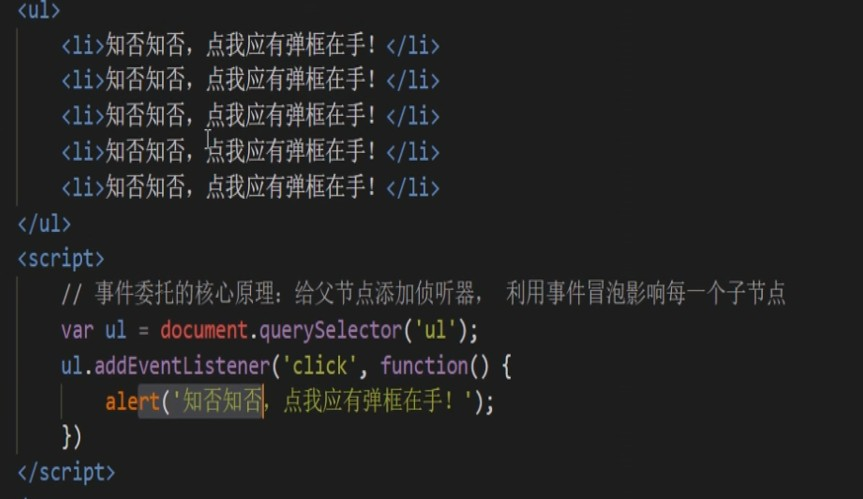
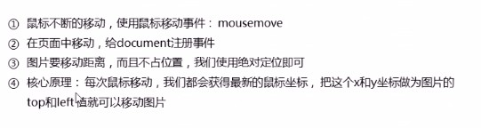

# JavaScript学习笔记 #
# 高级编程语言，解释性语言 #

查文档(内置函数文档)
	
	MDN ：http://developer.mozilla.org/zh-CN/

菜鸟教程
	
	https://www.runoob.com/js/js-tutorial.html

JS是单线程的语言

----------------------------------
# 基础 #
----------------------------------

## HTML /CSS /JS 关系 ##

HTML	决定页面结构

CSS		决定页面样式

JS		决定页面的行为

## JS组成 ##
	
1.ECMASctipt 语法  简称JS

	(1)Javascript	网景公司
	(2)Jscript 	微软公司 
	两者语法没啥区别

2.DOM 页面文档对象模型，对元素进行操作，大小，位置，颜色等

3.BOM 浏览器对象模型，对浏览器窗口进行操作，弹窗，跳转，分辨率等

## JS三种书写位置 ##
	
1.行内式，在元素内部去写代码

2.内嵌式

3.外部JS，双标签

推荐使用单引号

## 注释 ##
	
	单行注释 （ctel + /）： //
	块注释（shift+alt+a）： /**/ 

## 输入输出语句 ##

1.alert 浏览器弹出警示框，展示给用户
	
	alert('计算结果是')；

2.console.log 浏览器控制台打印输出信息，程序员调试用，按F12查看

	输出变量age
	console.log('年龄' + age);
	console.log('我是调试语句')；
	
	数字型	蓝色
	字符型	黑色
	null undefined 灰色		

3.prompt 浏览器弹出输入框，用户输入信息，取到的值全为字符型

	prompt("请输入年龄")；	

4.console.dir()	打印元素对象，查看属性和方法
## 变量 ##

### 作用：保存用户输入的数据 ###

### 使用：1.声明，2.赋值 ###
	
1.声明，关键字var，variable缩写，区分大小写，不以数字开头，可使用$ , _ 开头
		
	var name；  //声明一个名字为name的变量
	var name = '纳阳'；
	多变量声明
	var age = 18,
		address = '纳阳',
		sex = 'man';

	只声明不赋值，结果未定义
	也可以不声明直接使用（不推荐）
2.赋值
		
	name = '纳阳'；

3.输出结果
	console.log(name);
	
	例子：
	浏览器弹出对话框输入'刘德华'，按确定，弹出对话框‘刘德华’

	var myname = prompt('请输入名字：');
	alert（myname）；
	
## 数值类型 ##

JS变量类型，是根据代码运行等号右边的值来确定的

**动态类型，类型可变**
	
	var temp = 12;	//temp是数值型
	temp = 'abc';	//temp变为字符型
### 一.数据类型种类 ###
	
#### 1.简单数据类型 ####

值类型:string,number,boolean,undefined,null

存放在栈中,传送变量名传送的是值
	
**浮点数不能直接相比较，浮点计算会有误差,整数可以直接相比较**

(1)Number 	数字型 

	八进制			数字已0开头  var num = 010；
	十六进制			数字以0x开头 var num = 0xA；
	数字型最大值	console.log(Numbe.MAX_VAULE)
	数字型最小值	console.log(Numbe.MIN _VAULE)
	无穷大		alert(Infinity);
	无穷小 	alert(-Infinity);
	得出结果不是数字	NaN （not a Number）
	判断是否是数字
		isNaN(num);   是返回false  不是数字ture
	强制转换成数字	Number(age)；
	
(2)Boolean	布尔型

	ture 	对 1
	false	错 0
	
(3)String	字符型

	单引号，双引号 都可
	嵌套：外双里单，或里双外单都可
	字符串长度	console.log(myname.length);
	字符串拼接	+
	
(4)Undefined

	声明变量，未赋值
	赋值未声明

(5)Null

	空值
	Null+1 = 1；

#### 2.复杂数据类型  ####
	
引用类型:对象,数组

变量名指向栈中的地址,地址指向存放在堆中的数据,传送变量名传送的是地址
	
(2).数组
**不能给数组名直接赋值，否则里面的数据全部消失**

	创建数组
		var	数组名 = []; 
		var 数组名 = [1,2,'Nyang',ture];
		var 数组名 = new Array();	//空数组
		var 数组名 = new Array(2);	//长度为2的空数组
		var 数组名 = new Array(3,6);	//元素为[3,6]的数组
	获取数组元素，小标从0开始
		数组名[0];
		数组名[1];
		.......
	数组长度
		数组名.length
	新增数组元素
		修改length长度
			数组名.length = 5；	手动更改数组长度为5
		利用索引号增加
			数组名[6] = 2;		手动往后写元素							

### 二.检测数据类型 ###
	
	关键字 typeof

	例：
	var num = 10；
	console.log(typeof num);	

### 三.数据类型转换 ###
	
1.转字符串类型
	
	var num = 1;
	1.alert(num.toString());
	2.alert(String(num));
	3.alert(num+'');

2.转数字型
	
	var age = '18';
	1.console.log(parseInt(age));	//只得的整数，取最低，会去除其他字符，必须以数字开头
	2.console.log(parseFloat(age));	//可以得到小数
	3.console.log(Number(age));		//强制转换
	4.利用运算符号转换
		-减 *乘 /除
		'123'-'45'
		'12'*3
3.转布尔型
	
	var temp;
	Boolean(temp);
	
	0,NaN,Null,undefined  转为False
	其余全部转换位Ture

### 四.转义符 ###

	/n	换行
	\\	斜杠
	\'	单引号
	\"	双引号
	\t	缩进
	\b	空格

## 运算符 ##

### 算数运算符 ###
	
	+	+=
	-	-=
	*	*=
	/	/=
	% 取余
	++ 自加		前置 ++num	先加后运算
	-- 自减		后置 num--	先运算后加

### 比较运算符 ###
	
	返回布尔值
	<  >  <=  >=  
	==会默认转换数据类型  18=='18'	ture
	!=
	===全等  !==不全等	18 === '18'	false  

### 逻辑运算符，不支持(and，or，not) ###
	
	&&	与
	||	或
	!	非

### 短路运算 ###

	与		表达式1 && 表达式2
	1真，返回2
	1假，返回1
	
	或		表达式1 || 表达式2
	1假，返回2
	1真，返回1
	
## 控流分支 ##

### 分支 ###
	
1.IF语句
	
	if(条件表达式)
	{}
	else
	{}

	多分支
	if(条件表达式)
	{}
	else if(条件表达式)
	{}
	eles
	{}
2.switch语句,效率高于if
	
	变量与值必须全等
	switch(变量)
	{
		case 值1：
					break；
		case 值2：
					break；
		.........

		default：
					break；
	}

### 三元表达式 ###

	条件表达式 ？表达式1 ：表达式2

### 循环结构 ###
	
**break;退出循环			continue;跳到下一次循环**

1.for
	
	for(var i=0;i<100;i++)
	{}
	
2.while

	while(表达式)
	{}

3.do while
	
	do
	{
	
	}
	while(表达式)

## 函数 ##

1.声明,形参直接写,无需声明

**实参多余形参个数时,末尾实参舍去**

**实参少于形参个数时,多余形参为undefined,结果输出NaN**

	方法一:
		形参不用声明,用逗号隔开
		关键字：function
		function 函数名（形参1,形参2,...）
		{
			//函数体
		}
	
		例：
			function fun（num1,num2,）
			{
				console.log('Nyang',num1,num2);
			}
			
			接收数组
			function fun(arr)
			{
				for(i=0;i<arr.length;i++)
				{
					console.log(arr[i]);
				}
			}
			var arr = [1,2,3,4,5,6,7,8,9];
			fun(arr);

	
	方法二:
		函数表达式声明
			var fun = function()
			{
				//函数体
			}
		
		调用
			fun();
2.调用
	
	函数名(实参1，实参2，...)；

3.函数返回值,无需设置返回类型

	function 函数名（形参1,形参2,...）
	{
		return 返回值;
	}
	
	return只能返回一个变量,多个变量可以用数组的形式返回
	return [num1,num2,.....];

4.arguments的使用

	arguments是一个JS的内置对象
	arguments存储调用函数传的所有实参
	arguments是个伪数组
		具有length属性
		按索引方式存储
		没有真正数组的方法,如pop(),push()等	
	
	例:arguments承接了arr,num1,并以数组形式存放
		调用arguments[0]; arguments[1];
	
	function fun()
	{
		console.log(arguments);
		console.log(arguments.length);
		console.log(arguments[2]);
	}
	fun(arr,num1);

5.函数可以调用函数
	
## 变量作用域 ##

1.全局作用域

	

# Javascript BOM DOM操作 #

## DOM操作 ##

学习接口：干什么，参数是什么，返回值

### DOM简介 ###
是处理标记语言的标准接口，可以改变网页内容，结构和样式

文档：一个页面就是一个文档，document

元素：页面中所有标签，element

节点：网页中的所有内容，标签，文本，属性，注释等，node

以上内柔均看做是对象

### 获取元素 ###
#### 通过id获取元素 ####
使用getElementByld()获取带有ID的元素对象

	getElementByld(id)，	id必须是字符串，必须加引号

	例子：
		

		

        
#### 通过标签获取 ####
使用getElementsByTagName(),返回所有指定标签名的对象集合

	获取文档页面中所有的div标签内容
	var temp = dociment.getElementsByTagName("div");
	//内容也是字符串，返回元素对象集合，伪数字存储

	获取文档中所有<ol>中的<li>标签中的内容
	步骤：1.获取父元素对象 2.获取子标签对象

	方法一:
	var ol = dociment.getElementByld("ny")	//通过id获取父元素对象
	var li = ol.getElementsByTagName("li");	

	方法二：
	var ol = dociment.getElementsByTagName("ol");//通过标签获取父元素对象
	var li = ol[0].getElementsByTagName("li");

#### HTML5新增获取方法 ####
1.通过类名获取元素集合
	
	dociment.getElementByClassName("类名");
	
2.根据选择器选择，返回第一个元素对象
	
	dociment.querySelector(".box");	选择器

3.根据选择器选择，返回所有元素对象集合，数字形式存储
	dociment.querySelectorAll(".box");

#### 获取元素可以混合使用 ####

例：

	var temp = dociment.querySelector(".box").querySelectorAll("img");

#### 获取body对象 ####
	var temp = dociment.body;

#### 获取html对象 ####
	var temp = dociment.documentElement;

### 事件基础 ###
事件是可以被Javascript检测到的用户操作行为

事件组成：事件三要素
	
	事件源：事件被触发的对象

	事件类型：如何触发，如鼠标点击，经过，键盘按下等
	
	事件处理程序：通过函数赋值方式完成
	
	例：
	var temp = dociment.getElementByld("ny");	//事件源
	temp.onclick = function(){		//出发方式鼠标点击
		alert("你好");				//事件处理程序
	}
	
执行事件三步骤：
	
	1.获取事件源
		var temp = dociment.getElementByld("ny");
	2.注册事件（绑定事件）
		temp.onclick
	3.添加处理程序
		temp.onclick = function(){} 

### 操作元素 ###

操作元素属性，必须加上双引号

可以改变网页内容，结构和样式

1.获取元素内容，并改变元素内容 

	方法一：事件源.innerText,不可识别内容中的html标签

	事件源.innerText 可以获取标签中的内容，并且可以修改内容

	方法二：事件源.innerHTML,可识别内容中的html标签，使用最多

	事件源.innerHTML 可以获取标签中的内容，并且可以修改内容

	
contextmenu 鼠标点击右键事件

selectstart  鼠标开始选中事件

禁用按钮	事件源.disable = true;

修改button中的内容	事件源.innerHTML

mousemove	跟随鼠标事件

整个页面加载完毕执行
	
	window.onload = function(){}
	
2.改变元素属性,包括 id,alt,title,src,href等

	事件源.属性 = "";

	例：
	var img = dociment.getElementsByTagName("img");

	img.src = "图片路径"；
	img.title = "123";

	例：点击按钮更换图片
	
	1.获取元素
		var temp = dociment.getElementByld("ny");
		var img = dociment.getElementsByTagName("img");
	
	2.注册事件
		temp.onclick = function（）{
		img.src = "图片路径"；
	}

3.表单元素的属性操作

	操作的属性：type,value,checked,selected,disabled

	按钮被禁用：按钮源.disabled = true;
	
	事件源.属性 = "";

	表单中的值通过value修改
	
	inp.value.length 获取input中的值的长度

	例子：
	<button>按钮</button>
	<input type="text" value="清输入内容">

	

密码框显示明文：改变input的type类型即可
	
		

5.修改元素样式属性

方法：
	
	1.行内样式操作,修改的样式少时使用
		事件源.style.属性 = ""；
		属性必须采用驼峰命名法，把-写为驼峰方式：
			如：background-color 写为backgroundColor
		
	例：
		（1）获取事件源
			var div = document.querySelector("div");
		（2）注册事件，处理程序
			div.onclick = function(){
				this.style.backgroundColor = red；
			或	div.style.backgroundColor = red；
				this.style.width = 500px;
		
			}

	2.类名样式操作，检测到事件时，会把CSS写好的属性替换给事件源的元素，注意会覆盖元素原有的类名
		事件源.className = "css中类名样式"；

	（1）先在CSS中定义一个类名选择器的样式
			.new {
				width = 100px;
				color = blue;
			}

			

	（2）获取事件源，处理程序
			var div = document.querySelector("div");
			div.onclick = function(){
				this.className = "new"；
			或	div.className= "new"；
			}

	如果向保留原有类名，则合并写入
			div.className= "原有类名 new"；

6.排他思想

在一组元素中，执行某个元素时，某个元素就会有自己的样式，其余不变
	
	算法：
	
		1.所有元素全部清除样式
		
		2.给当前使用的元素设置样式
		
		利用for循环

例：按倒某个按钮时，按钮变色

	<button>1</button>
	<button>2</button>
	<button>3</button>
	<button>4</button>
	<button>5</button>

	

7.自定义属性的操作
	
自定义属性：程序员自己添加的属性

	获取元素的值：
	1.	事件源.属性；		//获取元素本身自带的属性值
	2.	事件源.getAttribute('属性');	//获取程序员的自定义属性值

	更改元素属性值：
	1.	事件源.属性 = "值"；		//设置元素本身自带的属性值
	2.	事件源.setAttribute('属性'，'值');	//设置程序员的自定义属性值，无属性则添加到元素中，有则改变值
	
	移除元素属性
	事件源.removeAttribute('属性');

8.html5自定义属性

目的：为了保存并使用数据

自定义属性名规范：

	以data-开头的，并且赋值
	
	例：

	获取自定义属性的新增方法，自定义属性名必须规范
		//其中属性名只写data-后的名称
		事件源.dataset.属性名；
		事件源.dataset["属性名"];

	例：事件源.dataset.Nyang；
		事件源.dataset["Nyang"];

9.在页面中创建新标签

	document.write('

');

### 节点操作 ###

页面中的所有元素，均叫做节点

利用节点层级关系获取元素，利用父子兄的节点关系获取元素，逻辑性强，操作简单，但兼容性差

节点三个基本属性：

	节点名称		事件源.nodeName
	节点值		事件源.nodeValue
	节点类型		事件源.nodeType

	元素节点 nodeType = 1
	属性节点 nodeType = 2
	文本节点 nodeType = 3 包括：文字，空格，换行等
	
常见父子兄关系

		
1.父级节点：事件源.parentNode	得到最近一级的父级节点

	var btns = document.getElementsByTagName("button");//获取事件源
	btns.parentNode；//父级节点

2.子级节点：

	事件源.childNodes	获得所有的子节点，包括元素、文本等
	事件源.children		只获得子元素节点
	事件源.firstChild	获得第一个子节点，包括元素、文本等
	事件源.lastChild		获得第一个子节点，包括元素、文本等
	
	事件源.firstElementChild		获得第一个元素节点，有兼容性问题，ie9以上
	事件源.lastElementChild		获得第一个元素节点,有兼容性问题，ie9以上

	事件源.children[索引号]		只获得任意子元素节点
	
	
3.兄弟节点

	事件源.nextSibiling;	获得下一个兄弟节点，包括元素、文本等,找不到是Null
	事件源.previousSibiling;	获得上一个兄弟节点，包括元素、文本等,找不到是Null
	事件源.nextElementSibiling;	获得下一个兄弟元素节点,有兼容性问题，ie9以上
	事件源.previousElementSibiling;	获得下一个兄弟元素节点，有兼容性问题，ie9以上

4.创建追加元素节点,动态创建元素节点
	
	1.	创建节点
		document.createElement('标签')
		innerHTML 比 createElement效率底
	2.	添加节点
		父级事件源.appendChild(创建的节点源);	//在后面插入元素
		父级事件源.insertBefore(创建的节点源,指定元素);//在指定元素的前面插入
	
	例:在ul中创建li
		//创建
		var ul = document.getElementsByTagName("ul");
		var li = document.createElement("li");
		//添加
		ul.appendChild(li);		//在后面插
		ul.insertBefore(li,ul.children[0]);//在前面插
5.删除节点

	父级事件源.removeChild(要删除的元素);
	
	例:
	ul.removeChild(ul.children[0]);

6.复制节点

	1.	复制节点
		要克隆的事件源.cloneNode();
		//括号为空,浅拷贝,只拷贝标签
		//括号内容为true,会拷贝标签和内容
	2.	添加节点
		父级事件源.appendChild(复制的节点源);//在指定元素的前面插入

	例:在ul中创建li
	//复制
	var ul = document.getElementsByTagName("ul");
	var li = ul.children[0].cloneNode();
	
	//添加
	ul.appendChild(li);		//在后面插
	ul.insertBefore(li,ul.children[0]);//在前面插

## 事件高级 ##

### 注册事件(绑定事件) ###

1.传统注册事件方式
	
	事件源.onclick等
	
	缺点无法添加多个事件

2.事件监听方式addEventListener

	
	可以同时添加多个事件

	例:事件类型是字符串,并且不加on
	事件源1.addEventListener('click',function(){
			//处理事件
	})
	或
	事件源1.addEventListener('click',fun);
	//处理事件
	function fun(){	}

	会同时处理

### 删除事件(解绑) ###

1.传统方式
	
	事件源.onclick = null;
	
2.监听方法解绑
	
	事件源1.removeEventListener('click',fun);
	//处理事件
	function fun(){	}

	会同时处理

### DOM事件流 ###
事件传播过程

事件流阶段:

	1.捕获阶段
	2.当前目标阶段
	3.冒泡阶段

	addEventListener只能得到冒泡或捕获阶段

	事件源1.addEventListener('click',function(){
			//处理事件
	},true)			//捕获阶段,先执行大盒子

	
	事件源1.addEventListener('click',function(){
			//处理事件
	},false或省略)		//冒泡阶段,先执行小盒子

### 事件对象 ###
事件对象写到处理程序函数的参数中

事件对象只有有了事件才会存在

事件对象内容和事件有关,如键盘事件,可以判断用户按下的键,鼠标事件可以获得鼠标的坐标

	例:
	事件源.addEventListener('click',function(事件对象){
			console.log(事件对象);	//输出鼠坐标,等信息
			console.log(window.事件对象);//ie678必须用window调用事件对象
	})

事件对象的常见属性和方法

	例:
	事件源.addEventListener('click',function(e){
			console.log(e.target);	//返回触发事件的元素
	})
	事件源.addEventListener('click',function(e){
			console.log(e.type);	//返回触发事件的类型
	})

	阻止默认行为(事件),让链接不跳转或提交按钮不提交
	链接事件源.addEventListener('click',function(e){
			e.preventDefault();	//阻止链接跳转,方法
			e.returnValue;		//底版本浏览器支持,属性
			return false;		//没有兼容问题,retun后面的代码不执行
	})

	阻止冒泡:
	链接事件源.addEventListener('click',function(e){
			e.stopPropagation();
			e.cancelBubble = ture;	//底版本支持
	})
	
### 事件委托 ###
	

### 其他鼠标事件 ###

1.右键禁止跳出菜单

contextmenu 鼠标点击右键事件

2.禁止鼠标选中

selectstart  鼠标开始选中事件
	

3.跟随鼠标事件

mousemove	跟随鼠标事件

跟随鼠标移动案例

	document.addEventListener('mousemove',functiong(e){	//只要鼠标移动1px，就会触发事件，进入函数
		var x = e.pageX;
		var y = e.pageY;
		pig.style.left = x + 'px';
		pig.style.top = y + 'px';
	});

### 鼠标事件对象 ###
	
	链接事件源.addEventListener('click',function(e){
			console.log(e);	//返回鼠标事件对象
			console.log(e.clientX);	//距离可视窗口的顶部距离
			console.log(e.pageX);	//距离整个页面的顶部距离
	})

对象参数

### 键盘事件对象 ###

传统方式

	document.onkeyup = function(){	console.log('我弹起了');	};

监听方式
	
	document.addEventListener('keyup',function(){
		console.log('我弹起了');
	})
	
	document.addEventListener('keydown',function(){
		console.log('我按下了');		//按着不松开一直打印，比keypress优先级高
	})

	document.addEventListener('keypress',function(){
		console.log('我按下了');		//按着不松开一直打印，不识别功能键，ctrl等
	})

	执行顺序：keydown  keypress  keyup
	
	keydown keyup 不区分字母大小写，只识别的是大写，可以识别功能键

	keypress 能区分字母大小写

键盘事件对象
	
	document.addEventListener('keypress',function(e){
		e.keyCode	//相应键的ASCII值
		if(e.keyCode === 65){		//判断按下'a'
			console.log('a');
		}
	})
	
	
按下 ‘s’ 让搜索框获得焦点
	
	var _input = document.querySelector("input");
	document.addEventListener('keyup',function(e){
		if(e.keyCode === 83)
		{
			_input.focus();		//让搜索框获取焦点
		}
	})

## BOM浏览器对象 ##

### BOM价绍 ###

BOM浏览器对象模型，核心对象是window，兼容性比较差，刷新，跳转等

BOM比DOM范围大

window 是全局变量，页面的所有变量都是window的属性，函数是window的方法

#### window 事件 ####

#### 1.窗口加载事件 ####

页面的所有元素变量函数都全部加载完才执行

传统方式只能写一次，写了多个以最后一个为准

监听方式可以写多个

	load	等页面所有元素加载完毕
	DOMcontentLoaded	等DOM加载完毕，不包括flash，css等就可以执行

#### 2.窗口大小变化事件 ####

	window.addEventListener('resize',function(){	//只要窗口变化1px，就触发函数
	})

	window.innerWidth		当前屏幕的宽度

#### 3.定时器 ####

1.setTimeout（）定时器  相当于定时炸弹，只调用一次函数

	window.setTimeout(函数|函数名，延时的毫秒数);	//定时时间到了，执行函数，只执行一次，延时为空时，立即执行
	
	var 定时器名 = window.setTimeout(function(){
	
	}，2000);		//延时2000毫秒执行函数

停止setTimeout（）定时器

	window.clearTimeout(定时器名);

2.setInterval（）定时器	重复调用，循环倒计时

	window.setInterval(函数|函数名，延时的毫秒数);	//定时时间到了，执行函数，循环执行，延时为空时，立即执行

	var 定时器名 = window.setInterval(function(){
	
	}，2000);		//延时2000毫秒执行函数

停止setInterval（）定时器

	window.clearInterval(定时器名);

### 同步异步任务 ###

同步：单线程

异步：任务交叉进行

JS执行机制

执行顺序：

	1.先执行同步任务
	2.再执行异步任务

主线程会循环检测任务队列中是否有异步任务，叫做事件循环

### location对象 ###	
用于获取或设置窗体的URL，并且可以用于解析URL

URL 统一资源定位符，是互联网的标准资源地址

location对象属性

	window.location.href;	//得到页面链接，可以重新赋值，是页面跳转

#### 数据在页面之间的传递 ####

思路

	在页面1中，写入表单
	form action="index.html">
		用户名：<input type="text" name = "uname">
		<input type="submit" value = "登录">
	</form>
	
	在页面2中获取表单输入的字符
	
	
#### location对象的方法 ####

	location.assign('网址');		//可以后退

	location.replace('网址');	//不可以后退

	location.reload();	//刷新页面

### navigator对象 ###

得到浏览器的信息，浏览器是手机端还是电脑端等

### history对象 ###

	
	history.back();			//后退页面
	history.forward();	//前进页面
	history.go(-1);		//后退一步

## PC网页特效 ##
### 元素偏移量offset系列 ###
动态获取元素的位置，偏移，大小等

offset属性只读，不能赋值

style属性可以获取，并赋值

### 元素可视区client系列 ###

获取元素可视区的相关信息，大小等

### 立即执行函数 ###
不需要调用，立马能自己执行的函数,独立创建了一个作用域

写法：
	
	1.	
	(function(形参){
	
	})(实参);

	2.	
	(function(形参){
	
	}(实参));
### 元素scroll系列 ###
获取滚动距离

## 本地存储 ##
1.数据存储在本地浏览器中

2.读取方便，刷新不丢失

3.容量大，sessionStrorage约5M，localStorage约20M

4.只能存储字符串，可以将对象JSON.stringify()编码后存储

