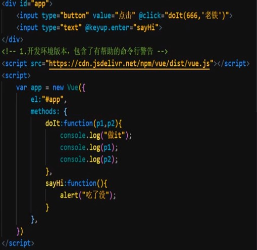

# Vue学习笔记 #

基础知识：html，CSS，JavaScript，AJAX

特点：JavaScript框架，简化Dom操作，响应式数据驱动

官网：cn.vuejs.org

代码中冒号代替等于号

## 使用Vue ##	

上官网->起步->安装->下载开发版Vue.js到html根目录 中拷贝代码

	//导入开发板Vue.js，导入本地

	

	//html语句
	

	  {{ message }}
	  {{ arr[5] }}
	  {{ man.sex }}
	

	//创建Vue实例对象，设置属性
	var app = new Vue({
			el: '#app',		//挂载点
			data: {			//数据
				message: 'Hell Vue!', 
				arr:["背景",12,123,456789,1],
				man:{
					name:"nang",
					sex:"男",
				}
				
			}
		})

	属性：
	el		el选择器，在被选中的元素及其内部的元素都可以使用，建议使用id选择器，因为具有唯一性，Vue不能挂载到body和html标签上

	data	数据

## Vue本地应用 ##

vue指令
	

### V-text ###
设置标签文本值，无论内容什么只会解析为文本

	
	//html语句
	

		<h1 v-text = "man.name + '1'">  </h1>		//不能再加其他内容，可拼接字符
		<h1>{{man.name + "1"}}nayang</h1>			//能再加其他内容，可拼接字符
	

	//创建Vue实例对象，设置属性
	var app = new Vue({
			el: '#app',		//挂载点
			data: {			//数据
				message: 'Hell Vue!', 
				arr:["背景",12,123,456789,1],
				man:{
					name:"nang",
					sex:"男",
				}
				
			}
		})

### v-html ###
v-html有html指令时使用,内容中的html结构会解析成标签

	//html语句
	

		
  
	
	

	//创建Vue实例对象，设置属性
	var app = new Vue({
			el: '#app',		//挂载点
			data: {			//数据
				message: 'Hell Vue!', 
				arr:["背景",12,123,456789,1],
				man:{
					name:"<h2>Nyang</h2>"
					sex:"男",
				}
				
			}
		})

### v-on/@ ###
元素绑定事件，v-on简写直接加@

	script src="vue.js"></script>

	 

		<input type="button" value="事件绑定" v-on:click = "dolt">	//单击事件
		<input type="button" value="事件绑定" v-on:monseenter = "dolt">	
		<input type="button" value="事件绑定" v-on:dblclick = "dolt">	//双击事件
		<input type="button" value="事件绑定" @dblclick = "dolt">		//简写双击事件
	 

	 

补充：

### 计数器 ###

### v-show ###
根据表达式的真假，切换元素的显示和隐藏，操纵的是元素样式，频繁操作时用

v-show = "",值为真显示，值为假隐藏

### v-if ###
根据表达式的真假，切换元素的显示和隐藏(操纵dom元素)，操作dom消耗性能

### v-bid ###
设置元素的属性，如src，title，class

可简写，直接写 :属性

### v-for ###
根据数据生成列表结构

### v-model ###
设置和获取表单元素的值（双向数据绑定）

### 网页应用 ###

axios网络请求库 + vue 

axios发送请求，获取响应内容

axios文档官网：githu.com/axios/axios

导入axios：

	

实例：

